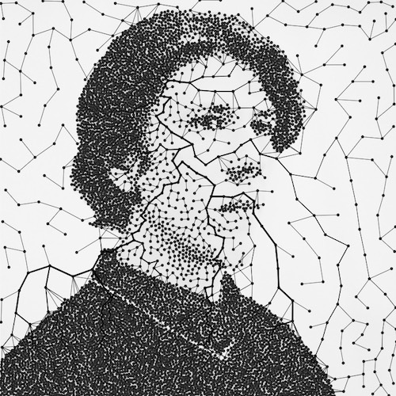

 

<h1 style="margin: 10px 0 25px; padding: 0">Andy Man</h1>

<ul style="margin-left: 30px; padding: 0;">
    <li>
        <a href="https://manoylovac.github.io/noc2">Природа коду</a> — український переклад цікавезної книги про природні симуляції <a href="https://natureofcode.com">The Nature Of Code</a>  (автор <b>Daniel Shiffman</b>)
    </li>
     
    <li>
        <a href="https://thebookofshaders.com/?lan=ua">Книга про шейдери</a> — український переклад книги <a href="https://thebookofshaders.com">The Book Of Shaders</a>  (автори <b>Patricio Gonzalez Vivo</b> та <b>Jen Lowe</b>)
    </li>
     
    <li style="color: gray">
        <b>Виявлення колізій</b> (WIP) — український переклад онлайн-книги з виявлення перетинів між геометричними фігурами <a href="https://www.jeffreythompson.org/collision-detection" target="_blank">Collision Detection</a>  (автор <b>Jeffrey Thompson</b>)
    </li>
</ul>

<h2 style="margin: 0; padding:0;">Українською кому книги програмування про креативне потрібні?</h2>

Вітаю друзі!

Сподіваюсь грайливий заголовок не дуже збив вас з пантелику і ви все одно відважилися читати далі.

Сьогодні хочу поділитися з вами своїм перекладом нещодавно оновленої і чудової книги Деніела Шиффмана [The Nature Of Code](https://natureofcode.com/) про симуляції природних процесів, яка містить багато практичних та інтерактивних прикладів. З дозволу автора [переклад книги](https://manoylovac.github.io/noc2/translation.html) доступний онлайн. Можна одразу перейти до [сторінки прикладів](https://manoylovac.github.io/noc2/examples.html) та оцінити практичну сторону матеріалу.

Початок перекладу стартував гарячим літом 2023-го у спокійних домашніх умовах та легких капцях на босу ногу з усіма доступними зручностями, а завершився наступного пекельного літа 2024-го року, вже у лавах ЗСУ з важкими берцями та постійними переміщеннями. Тож, якщо вам буде цікаво дізнатися про процес перекладу більше, сміливо питайте — буду радий поділитися своїм досвідом.

Також, якщо вам до вподоби цей проєкт, ви можете допомогти покращити його. Можливо ви маєте змогу підготувати зображення з перекладом, виправити неточності чи термінологію, пошерити цікавинку серед знайомих, знайти видавництво, зробити легший спосіб для оновлення тощо. Через проходження служби у мене наразі навряд чи буде для цього достатньо часу і можливостей, тож при бажанні долучайтеся. Контакти є на [сторінці з перекладом](https://manoylovac.github.io/noc2/translation.html#contacts).

PS: минулим літом я також переклав невелику класичну книгу по шейдерам — [The Book Of Shaders](https://thebookofshaders.com/?lan=ua) — це була моя перша спроба “open-source” перекладу, тому, якщо ви хотіли познайомитися з шейдерами, тепер можете зробити це українською.

PSS: наразі планую по змозі завершити переклад невеликої книги з виявлення зіткнень між геометричними фігурами — [Collision Detection](https://www.jeffreythompson.org/collision-detection).

З найкращими побажаннями Андрій Манойлов!

